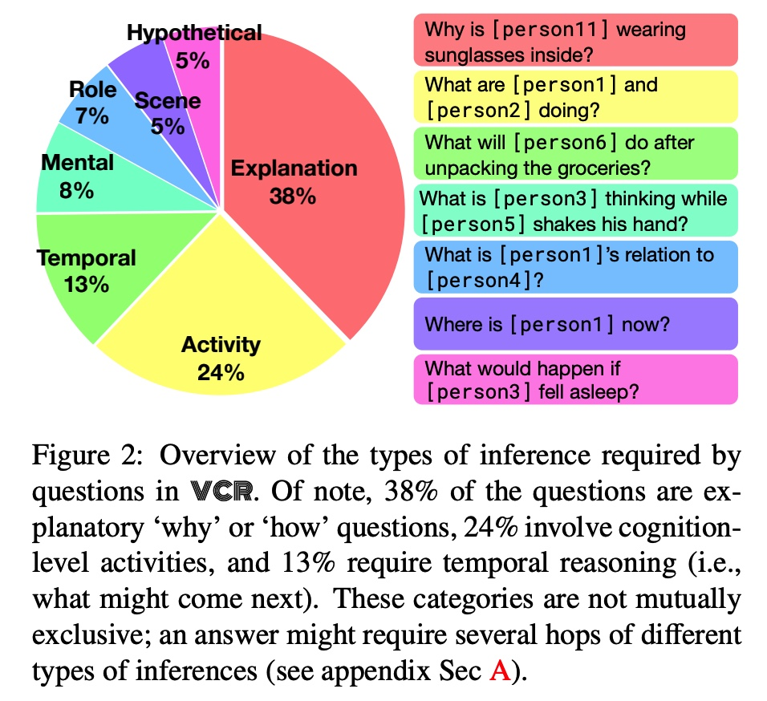

# awesome-VCR
对VCR论文的一些整理

# 1. CVPR2019: From Recognition to Cognition: Visual Commonsense Reasoning
## Motivation:
1.就是使用movie scene中的图片来做的数据集，其中问题是多选题，然后人们在选择答案的同时还必须提供答案所需要的rationale justifying its answer.

2.290k multiple choice QA problems derived from 110k movie scenes.**使用的是Adversarial Matching来生成高质量的问题的，然后我们观察到现有的vqa sota仅仅只有45的精度，不像人类的90精度。因此我们提出一个R2C模型65%**

## machine必须provide a rationale justifying 为什么答案是正确的。referring to the details of the scene, as well as background knowledge about how the world works.
不仅需要理解图像中的具体的场景；

还需理解世界的知识。

90k pairs of questions, answers,
and rationales, over 110k unique movie scenes.

大规模VCR数据集。

## 创建这个数据集有很大的难点
1.如何避免annotation artifacts就是注解太费力。

2.然后human-written answers保持unexpected 但是distinct biases模型可以轻松探索的。**这里的answer-bias就是因为统计，如果正确答案都是同一风格的话，那么我们改进就是可以做一个数据增强**

**这些问题导致模型可以选择答案甚至不需要看问题**

## 针对上述的2
我们就是recycle每个正确答案给其他的问题三次，此时作为她们的negative answers.那么这四项选择有相同的概率是正确的。

**我们的recycling算法就是a knob that 可以控制tradeoff between human和machine。对于机器而言回答这个问题比较难，但是对于人类就很容易**

## 我们的网络结构
1.Recognition to Cognition Networks(R2C)**3 inference steps**

1)首先就是ground定位到和NLP meaning接近的image regions。

2）contextualize：这个就是综合an answer的意思和question，以及global objects not mentioned。

3）最后就是reasons over this shared 表达去获得最终的答案。

## 1.关于我们认知层面的问题设置

我们的问题/答案和原理都是结合detection tag和自然语言来呈现的。**这里就是一个unambiguous link between the description of an object和对应的image region～**

比如**[person2]**

我们这个任务可以看作是两个subtask，第一个就是Q-》A，第二个就是QA->R.

### Q-A
这里就是query是question问题，然后response就是answer choices。

### QA-R
这个任务就是answer justification，query就是拼接在一起的问题和正确的答案，同时responses就是rationale choices。

4选题。

### 我们直接跳过data collection和adversarial matching环节

## 2. R2C 网络

### 2.1. Grounding@就是结合visual feature来做一下对应的query的表达，和answer-reposne的表达。

我们可以看到这里的定位就是针对tag环节会结合visual feature作为lstm的输入。

这里的visual feature就是appearance feature+label embedding～

**就是LSTM over all positions是r@response，然后q@query～**

### 2.2. COntextualization

这里就是使用answr做一个query和visual的attn表达。

### 2.3. Reasoning
最后将三者混合在一起送到BiLSTM上去做一个模型。

